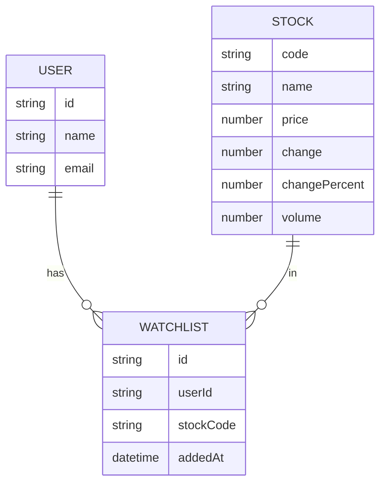

## 1. Architecture Design

```mermaid
graph TB
  subgraph "Frontend"
    A[React App]
    B[Components]
    C[Pages]
    D[State Management]
  end
  subgraph "Data"
    E[LocalStorage]
    F[Mock Data Service]
  end
  subgraph "Visualization"
    G[Recharts]
  end
  A --&gt; B
  A --&gt; C
  A --&gt; D
  D --&gt; E
  C --&gt; F
  C --&gt; G
```

## 2. Technology Description
- Frontend: React@18 + TypeScript + TailwindCSS@3 + Vite
- Initialization Tool: vite-init
- Backend: None (使用Mock数据)
- Database: LocalStorage
- Charts: Recharts
- Icons: Lucide React
- State Management: Zustand

## 3. Route Definitions
| Route | Purpose |
|-------|---------|
| / | 首页 - AI对话 + 热门股票 |
| /market | 行情页 - 股票列表 + 搜索 |
| /watchlist | 自选页 - 自选股管理 |
| /profile | 个人中心 - 用户设置 |
| /stock/:code | 股票详情页 - K线图 + 分析 |

## 4. API Definitions (N/A)
本项目使用Mock数据，不涉及后端API。

## 5. Server Architecture Diagram (N/A)
不适用

## 6. Data Model

### 6.1 Data Model Definition



### 6.2 Data Definition Language
不适用，使用LocalStorage存储数据。
