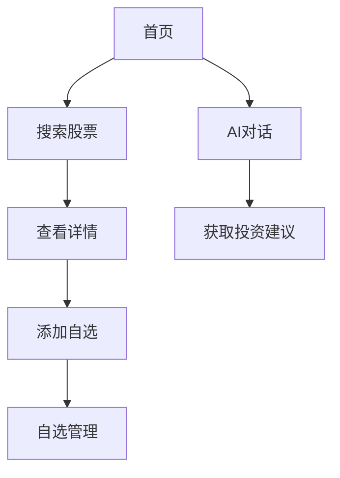

## 1. Product Overview
智能炒股助手App是一款为个人投资者提供股票数据分析、投资建议和交易辅助的移动端Web应用。
- 主要功能：股票行情监控、智能选股、投资组合管理、AI分析报告
- 目标用户：个人投资者、股票交易者

## 2. Core Features

### 2.1 User Roles
| Role | Registration Method | Core Permissions |
|------|---------------------|------------------|
| Normal User | Email registration | 浏览行情、管理自选股、查看分析报告 |

### 2.2 Feature Module
1. **首页**：股票行情概览、热门股票推荐、AI智能对话
2. **行情页**：实时行情数据、股票筛选、技术分析图表
3. **自选页**：自选股票列表、涨跌幅排序、投资组合
4. **个人中心**：用户设置、账户管理、历史记录

### 2.3 Page Details
| Page Name | Module Name | Feature description |
|-----------|-------------|---------------------|
| 首页 | AI智能对话 | 与AI助手交流，获取投资建议、股票分析 |
| 首页 | 热门股票 | 展示涨幅榜、跌幅榜、成交额榜 |
| 行情页 | 股票搜索 | 按代码或名称搜索股票 |
| 行情页 | 技术分析 | K线图、MACD、KDJ等指标分析 |
| 自选页 | 自选管理 | 添加/删除自选股、自定义分组 |
| 个人中心 | 账户设置 | 修改个人信息、通知偏好 |

## 3. Core Process
用户打开App后，首先看到首页的热门股票和AI对话入口。可以通过搜索找到感兴趣的股票，添加到自选股，然后在行情页查看详细分析。AI助手可以提供实时投资建议。

## 4. User Interface Design
### 4.1 Design Style
- Primary colors: 深蓝 (#1e3a8a)、青绿 (#06b6d4)
- Secondary colors: 橙红 (#f97316)、绿色 (#10b981)
- Button style: 圆角矩形，有悬停和点击效果
- Font: Inter, 12-20px为主
- Layout style: 卡片式布局，底部导航
- Icon style: Lucide图标库，线性风格

### 4.2 Page Design Overview
| Page Name | Module Name | UI Elements |
|-----------|-------------|-------------|
| 首页 | AI智能对话 | 渐变背景，悬浮卡片，消息气泡动画 |
| 首页 | 热门股票 | 网格布局，涨跌幅颜色区分，滑动效果 |
| 行情页 | 技术分析 | 交互式图表，时间轴选择，指标切换 |
| 自选页 | 自选列表 | 滑删操作，分组标签，实时价格更新 |
| 个人中心 | 设置页面 | 开关控件，分段选择器，表单布局 |

### 4.3 Responsiveness
- Mobile-first设计，适配360px-480px屏幕
- 触摸优化：按钮最小48px，间距适中
- 支持横屏和竖屏切换

### 4.4 3D Scene Guidance
不适用
